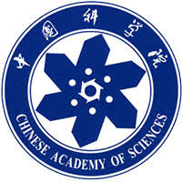








Yang LUO is currently a second-year Ph.D. student in Microelectronics at the Hong Kong University of Science and Technology (Guangzhou), where he is supervised by [Prof. Yuzhe Ma](https://yuzhema.people.ust.hk/) and [Prof. Yeyu Tong](https://personal.hkust-gz.edu.cn/yeyutong/). His research focuses on Machine Learning and Electronic Design Automation (EDA), with particular interests in AI4EDA (leveraging AI algorithms to automate chip design processes), optimization under engineering constraints, generative models (exploring their applications in traditional EDA workflows), and Large Language Models (developing EDA software oriented towards LLMs).

He received his B.E. degree in Intelligence Science and Technology from the University of Science and Technology Beijing, China. He also holds an M.S. degree from the School of Computer Science and Technology, University of Chinese Academy of Sciences, Beijing, China.

If you're interested in my research, feel free to reach out! I look forward to discussing and collaborating with you!

# 🔥 News
- *2024.06*: &nbsp;🎉🎉 Excited to announce that my first paper as a Ph.D. student has been accepted to [**ICCAD 2024**](https://2024.iccad.com/)! Many thanks to my advisor and colleagues for their support!
- *2023.09*: &nbsp;🎉🎉 I'm excited to have joined HKUST (GZ)! Looking forward to my research journey ahead and outcomes!
# 📝 Publications 

<i>“What I cannot create, I do not understand.”</i> — Richard Feynman

ICCAD 2024

 Enabling Robust Inverse Lithography with Rigorous Multi-Objective Optimization 

<i>In IEEE/ACM  International Conference on Computer-Aided Design (ICCAD ’24)<i>

**Yang LUO**, Xiaoxiao LIANG, Yuzhe MA

- **Contribution**: Theoretical analysis and algorithm design, experiment implementation, and paper writing

IJCAS 2020

 [Fixed-time synchronization of complex-valued memristive BAM neural network and applications in image encryption and decryption](https://link.springer.com/article/10.1007/s12555-018-0676-7) 

<i>International Journal of Control, Automation and Systems (IJCAS ’20)<i><strong></strong>

YongZhen GUO, **Yang LUO**, WangWei PING, et al.

- **Contribution**: Theoretical analysis and algorithm design, experiment implementation, and paper writing

# 🛠 Work-in-progress

- *Inverse Lithography Technology*: &nbsp;🔨 Developing a mask optimization algorithm for lithography to improve the robustness of inverse lithography.
- *Hardware Language Generation*: &nbsp;🔨 Investigating the potential of large language models for generating hardware description languages.
- *LLM-oriented EDA Tools*: &nbsp;🔨 Designing a new generation of EDA tools that leverage the capabilities of large language models.

# 🎖 Honors and Awards
- *2020* Tianchi competition of MEDIA-AI Alibaba Algorithm Challenge - HD Video Segmentation (6/733)
- *2019* Excellent graduates of Beijing University of Science and Technology
- *2018* National Third Prize of Siemens Intelligent Manufacturing Competition
- *2018* National Third Prize in the 8th "Huawei Cup" National Undergraduate Intelligent Design Competition
- *2016~2018* People's Scholarship, Outstanding student

# 📖 Educations

M.S. degree from [School of Computer Science and Technology](https://scce.ucas.ac.cn/), University of Chinese Academy of Sciences, Beijing, China

2019.09 - 2023.01

B.E. degree from [Intelligence Science and Technology](https://ai.ustb.edu.cn/), the University of Science and Technology Beijing, China

2015.09 - 2019.06

# 💻 Internships
- *2021.08 - 2022.06*, SmartMore, Shenzhen. Working with Xufeng Yao and [Prof.Bei Yu](https://www.cse.cuhk.edu.hk/~byu/) on OCR and model compressing.
- *2021.04 - 2021.07*, Samsung Advanced Institute of Technology & Peking University ZERO Lab, Beijing. Working with Bin Dai on group-equivalent network for object detection
